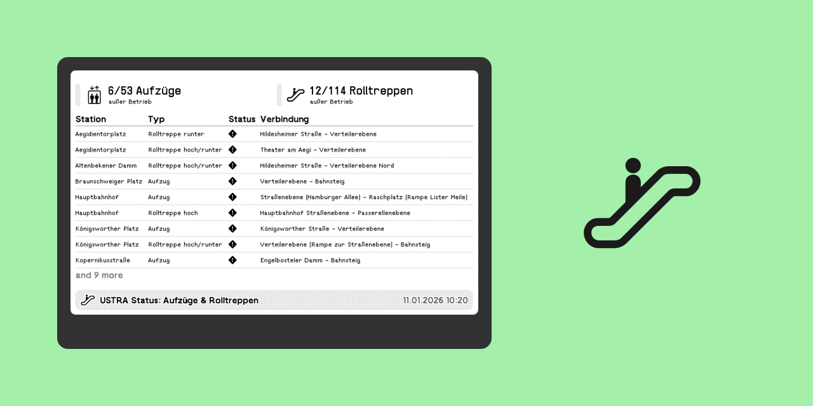
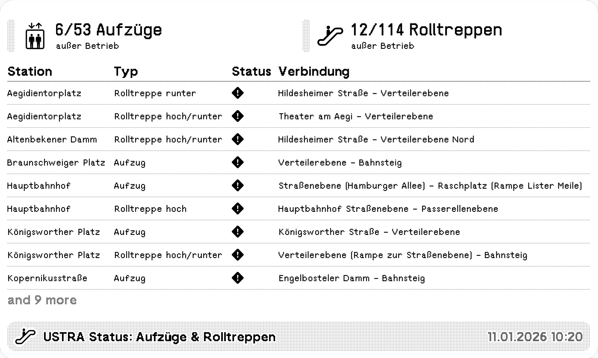
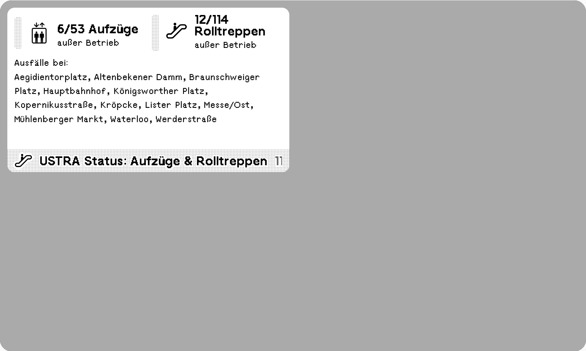

# TRMNL Üstra Status: Elevators & Escalators

A TRMNL Plugin showing the status of elevators and escalators from the public transport operator ÜSTRA in Hannover.



## Preview





## Installation

## Development

1. Install Docker
2. Run trmnlp in the project root directory:

``` sh
./bin/trmnlp serve
```

## License

This project is open source licensed under the BSD 3-Clause License. Please see the [LICENSE file](LICENSE) for more information.
